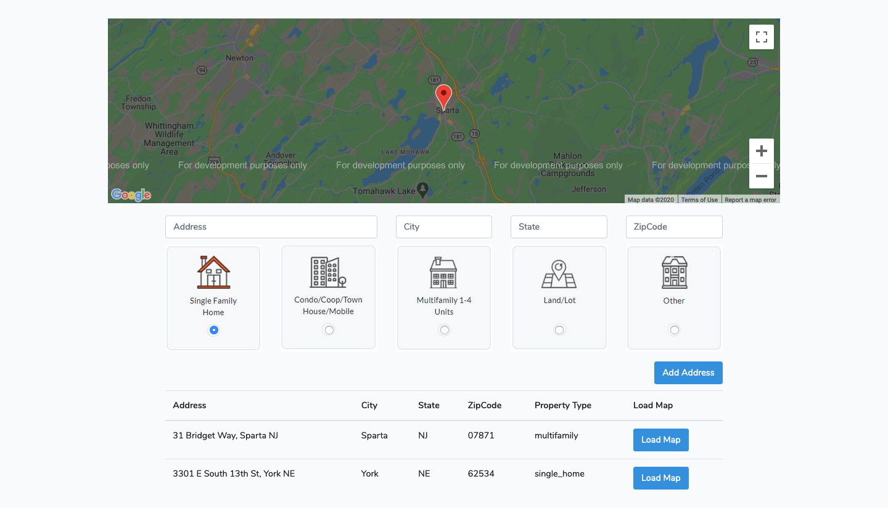

# Smarty Streets API Integration

## Technologies

#### Back-end Framework and Libraries

- Framework: Laravel
- Libraries: smarty streets PHP SDK

#### Front-end Technologies

- Boostrap
- VueJS
- Vue2-google-maps Component

## Instructions for setting up

- Clone the Project
- Navigate to the Project directory and run 
  - `composer install`
  - `cp .env.example ./.env` and add all the respective settings in place of their placeholders
  - `php artisan migrate`
  - `php artisan db:seed`
  - `npm install`
  - `npm run build` // or you may run `npm run dev` or `npm run watch`
  - `php artisan serve` or you may use valet to run the application

### Working of Application

- By Default there will be 2 Addresses in the address Table (if you have ran the seeder), you can click on **Load Map** to Load the respective address Map in the Map section.
- You can add Address by typing addresses in the Address field, it will give you suggestions, you can select any Address from the Suggestions to load City, State and ZipCode of the selected Address.
- The newly added Address will be loaded in the Map and the Table will be refreshed.

### Caveats

- Ideally, I should have used US Autocomplete API from Front-end instead I am using SmartyStreets Address Lookup API since the Autocomplete API requires a dedicated Host/IP to make requests.
